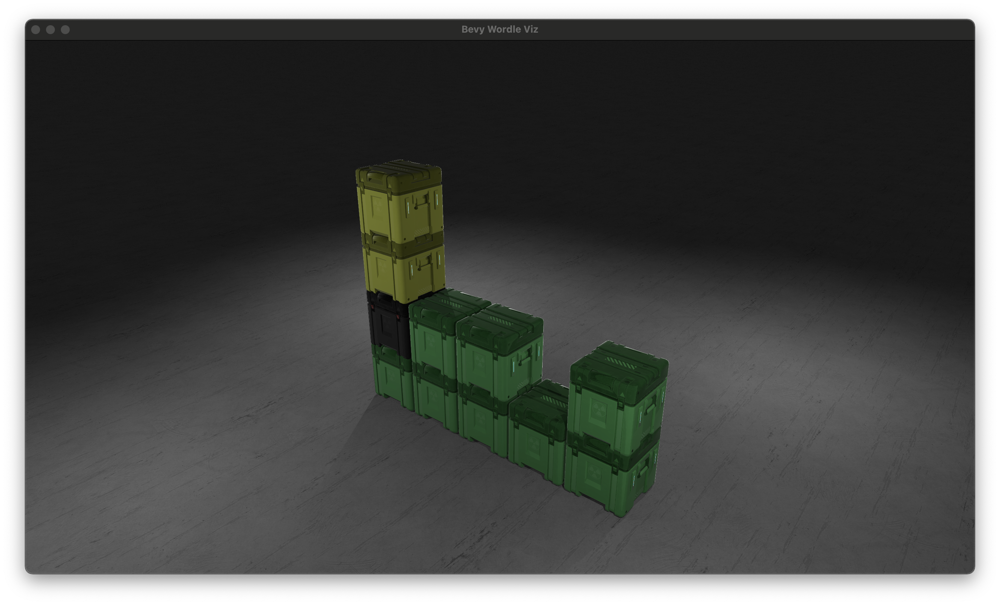

# bevy_wordle_viz



## Dependencies

### Linux

This might work on linux. 🤷

[bevy](https://github.com/bevyengine/bevy/blob/main/docs/linux_dependencies.md) and [rust-clipboard](https://github.com/aweinstock314/rust-clipboard#prerequisites) have dependencies on linux.

## Build

### Web platform

[wasm-server-runner](https://github.com/jakobhellermann/wasm-server-runner) makes this super easy.

```bash
cargo run --target=wasm32-unknown-unknown [--release]
```

### Other platforms

```bash
cargo run [--release]
```

## Usage

- Use the [Wordle](https://www.powerlanguage.co.uk/wordle/) "share" button to copy data to clipboard.

- Paste it.

## Notes

Your favorite social media platform or chat app might mangle the output of wordle's share feature by replacing glyphs with their own icons.

This works with raw unicode from wordle and pastes from twitter or slack.

```plain
Wordle 216 4/6

🟨⬛⬛⬛⬛
🟨⬛⬛⬛⬛
⬛🟩🟩⬛🟩
🟩🟩🟩🟩🟩
```

## TODO

- [ ] Optionally render to stdout for piping to ffmpeg
